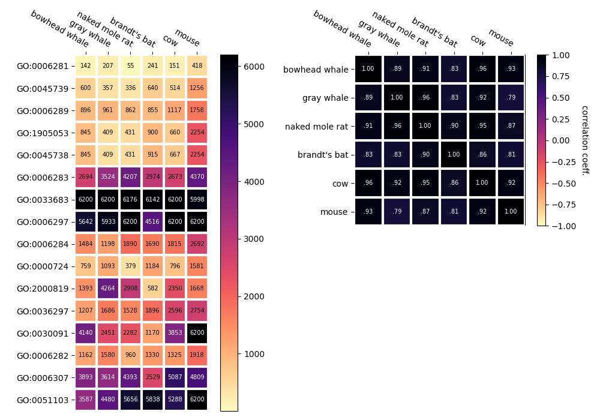
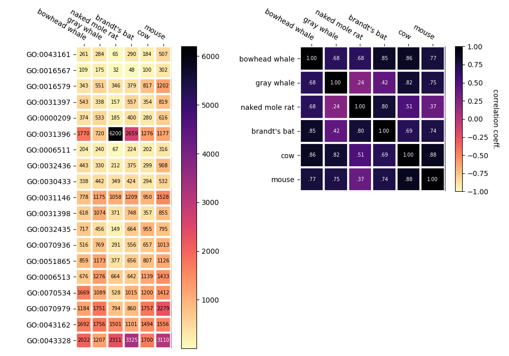

### Transcriptomes comparison through Go ranks.

Reproduced liver transcriptomes comparison from

Toren D, Kulaga A, Jethva M, Rubin E, Snezhkina AV, Kudryavtseva AV, Nowicki D, Tacutu R, Moskalev AA, Fraifeld VE. Gray whale transcriptome reveals longevity adaptations associated with DNA repair and ubiquitination. Aging Cell. 2020 [[paper]](https://pubmed.ncbi.nlm.nih.gov/32515539/) [[original code]](https://github.com/antonkulaga/gray-whale-expressions)

for 4 long-lived species:
* Bowhead whale, 211 years
* Gray whale, 77 years
* Brandt's bat, 41 years
* Naked Mole-Rat, 31 years

and 2 short-lived:
* Cow, 20 years
* Mouse, 4 years

#### Dependencies
* fastq-dump
* fastqc
* trimmomatic
* Trinity
* TransDecoder
* diamond
* salmon

#### Prepare data

* Create UniRef90 protein databases
  * wget ftp://ftp.uniprot.org/pub/databases/uniprot/current_release/uniref/uniref90/uniref90.fasta.gz
  * run [scripts/run_diamond_db.sh](scripts/run_diamond_db.sh)

* Prepare GO annotations
  * wget ftp://ftp.ebi.ac.uk/pub/databases/GO/goa/UNIPROT/goa_uniprot_all.gaf.gz
  * Filter with Mammalia taxons & Aspect(s)
    run python3 [utils/prep_mammalia_goa.py](utils/prep_mammalia_goa.py)

* Download RNA-seq data [scripts/run_download.sh](scripts/run_download.sh)

#### Pipeline
* [scripts/run_trimmomatic.sh](scripts/run_trimmomatic.sh)
* [scripts/run_quality.sh](scripts/run_quality.sh)
* [scripts/run_trinity.sh](scripts/run_trinity.sh)
* [scripts/run_transdecoder.sh](scripts/run_transdecoder.sh)
* [scripts/run_diamond.sh](scripts/run_diamond.sh)
* [scripts/run_transdecoder.sh](scripts/run_transdecoder.sh)
* [scripts/run_salmon_build.sh](scripts/run_salmon_build.sh)
* [scripts/run_salmon.sh](scripts/run_salmon.sh)
* [utils/process1.py](utils/process1.py)
* [utils/process2.py](utils/process2.py)
* [utils/process3.py](utils/process3.py)

#### Create final heatmaps
  * [utils/heatmap_d.py](utils/heatmap_d.py)
  * [utils/heatmap_u.py](utils/heatmap_u.py)

#### Heatmaps

As a result, using only biological processes for ranking, I got the following heatmaps

_**DNA repair**_

_**Ubiquitination**_

